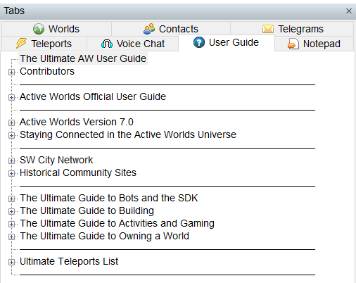
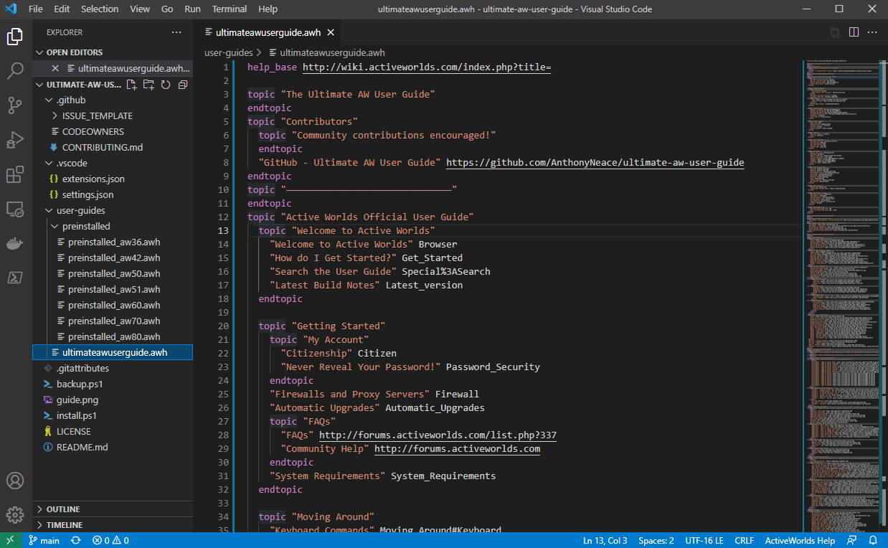

ultimate-aw-user-guide
===================

This repository hosts the Ultimate AW User Guide, a community-maintained modification of the pre-installed User Guide in the [ActiveWorlds](https://www.activeworlds.com) virtual worlds software.

The Ultimate AW User Guide is a modification made to the official AW User Guide which enhances it by adding newer, more relevant categories and new features such as wiki inclusion and a comprehensive teleports list. 

This takes the place of the existing user guide, which may be found in the AW tabs menu by pressing F9 and looking under the 'User Guide'/'Help' tab.

The Ultimate AW User Guide won a Cy Award on November 13, 2010 for Best Bot/Software.

## Installation

The Default AW User Guide is configured, when installing Active Worlds, in plaintext at `C:\Users\$env:username\AppData\Local\ActiveWorlds 3D\Help\default.awh`. Simply replace the file at this location with the Ultimate AW User Guide and restart Active Worlds.

### Script Install

Clone this repository to your local machine and run `.\install.ps1` via a PowerShell terminal. The install script will copy the Ultimate AW User Guide from the repository directory into the ActiveWorlds Help directory.

#### Install Script Flags

* You can set the `-Debug` flag to get some more verbose output if the script failing and you need to troubleshoot.
* You can set the `-Remote` flag to download the user guide from GitHub instead of using your local file.

### Manual Install

Follow these instructions if you are unable to use the install script above:

* Go to: https://raw.githubusercontent.com/AnthonyNeace/ultimate-aw-user-guide/main/user-guides/ultimateawuserguide.awh
* The next step will overwrite the previously existing AW User Guide at this location.  You can back it up by renaming it before completing the next step.
* Save As > default.awh in the AW User Guide directory on your local machine.  This is usually at `C:\Users\<your_windows_user>\AppData\Local\ActiveWorlds 3D\Help`
* When ActiveWorlds next launches, it will pull whatever is at `C:\Users\<your_windows_user>\AppData\Local\ActiveWorlds 3D\Help\default.awh` into your User Guide tab.

## Contributions

This repository is accepting pull requests for any ActiveWorlds-related content that would be appropriate for the User Guide, to the discretion of the maintainers. Please test your changes prior to submitting a PR by simply launching the ActiveWorlds browser with your changes and observing that they work as expected.

We recommend editing the User Guide in vscode for best developer experience.  We wrote a vscode extension [awh-for-vscode](https://marketplace.visualstudio.com/items?itemName=AnthonyNeace.awh-for-vscode) to assist with .awh development.

## Troubleshooting

### The User Guide is Blank in ActiveWorlds

* Check the `default.awh` file encoding.  ActiveWorlds expects the User Guide to be encoded as `UTF-16 LE BOM`.  Other encodings such as `UTF-8` are confirmed to cause the user guide tab to load blank.
* Check that all `topic` lines are terminated with a matching `endtopic` line.  Any topics left hanging may not render correctly.

### The User Guide contains one or more dead links

Please help to resolve this in one of the following ways:

* [Report it!](https://github.com/AnthonyNeace/ultimate-aw-user-guide/issues/new?assignees=&labels=dead-link&template=dead-link.md&title=%5BDEAD+LINK%5D) Open an issue to share the problem with us.
* Fix it! [Open a pull request](https://github.com/AnthonyNeace/ultimate-aw-user-guide/compare) replacing the dead link with a cached version of the page at archive.org, or removing the dead link if there is no cached page available.

## Older Versions

The previous home of the Ultimate AW User Guide can be found at the [SW City Builder's Academy]( http://www.swcity.net/academy/index.php?n=Main.UltimateAWUserGuide)

## Attribution

* Hyper Anthony (#350539) - Compiled Guide.
* Bach Zhaa (#360197) - Creating so many of the resources that were included in this guide.
* Kenneth (#313432) - Suggesting the World Owner guide.
* Tunablues (#171610) - Directing me to AWSchool resources.
