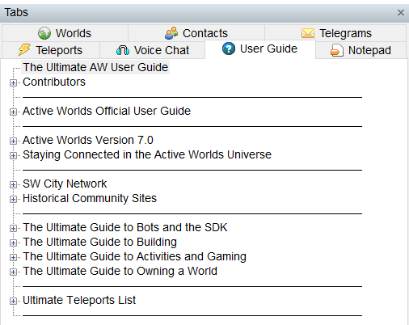

ultimate-aw-user-guide
===================



This repository hosts the Ultimate AW User Guide, a community-maintained modification of the pre-installed User Guide in the [ActiveWorlds](https://www.activeworlds.com) virtual worlds software.

The Ultimate AW User Guide is a modification made to the official AW User Guide which enhances it by adding newer, more relevant categories and new features such as wiki inclusion and a comprehensive teleports list. 

This takes the place of the existing user guide, which may be found in the AW tabs menu by pressing F9 and looking under the 'User Guide'/'Help' tab.

The Ultimate AW User Guide won a Cy Award on November 13, 2010 for Best Bot/Software.

### Installation

The AW User Guide is configured, by default, in plaintext at the client at:

```powershell 
C:\Users\$env:username\AppData\Local\ActiveWorlds 3D\Help\default.awh
```

Simply clone this repository and run `.\install.ps1` in this directory to copy the Ultimate AW User Guide into the ActiveWorlds Help directory.

### Contributions

This repository is accepting pull requests for any ActiveWorlds-related content that would be appropriate for the User Guide, to the discretion of the maintainers. Edit in VS Code for best experience.

Please test your changes prior to submitting a PR by simply launching the ActiveWorlds browser with your changes and observing that they work as expected.

### Troubleshooting

#### The User Guide is Blank in ActiveWorlds

* Check the `default.awh` file encoding.  ActiveWorlds expects the User Guide to be encoded as `UTF-16 LE BOM`.  Other encodings such as `UTF-8` are confirmed to cause the user guide tab to load blank.
* Check that all `topic` lines are terminated with a matching `endtopic` line.  Any topics left hanging may not render correctly.

### Older Versions

The previous home of the Ultimate AW User Guide can be found at the [SW City Builder's Academy]( http://www.swcity.net/academy/index.php?n=Main.UltimateAWUserGuide)

Attribution
-----------

#### Ultimate AW User Guide

* Hyper Anthony (#350539) - Compiled Guide.
* Bach Zhaa (#360197) - Creating so many of the resources that were included in this guide.
* Kenneth (#313432) - Suggesting the World Owner guide.
* Tunablues (#171610) - Directing me to AWSchool resources.
